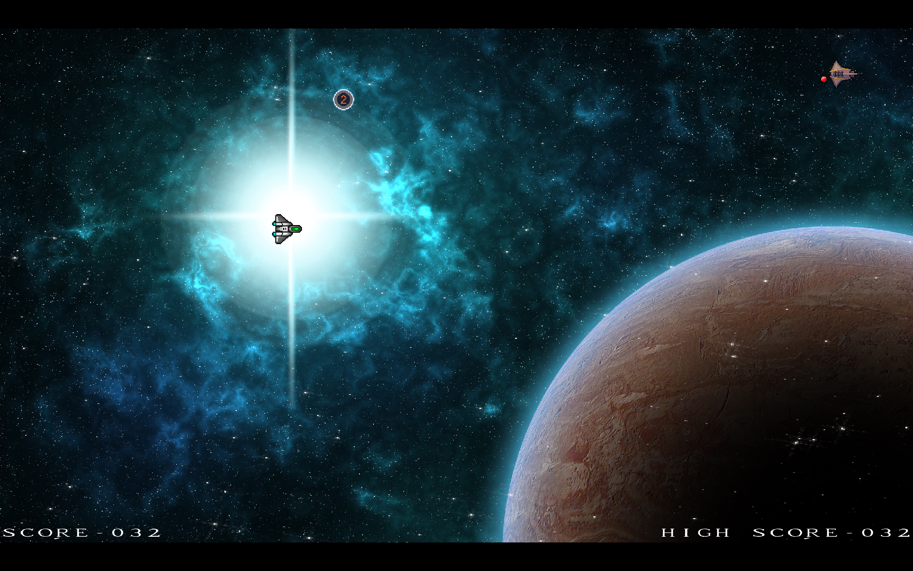

# SMJack
Star Marine Jack. A top down 2D space shooter made using C. 
I  developed this game as an educational tool for other devs who are interested in low level development and want to make a game, but do not want to bother with very basic stuff. The code has been structured and documented for others to read and learn from with hope of being able to turn it into their own game. 
Please notice that all the assets that I have used myself are royalty free and their license have been written in their providing website. But, I do not share the assets with the code to avoid any legal conflicts. Therefore, I only share the link to the page of the providers of the assets at the end of the README file.

## Dependencies
The only external library used is SDL2 along SDL image and SDL mixer

### Screenshot

## Code structure
The code structure has been highly inspired by the source code of [DOOM](https://github.com/id-Software/DOOM). 
Files have been organized by their use case with the first letters followed by an underline representing the purpose. 
- i -> internal (the very foundational and system dependant)
- r -> rendering
- ui -> for rendering the GUI (currently only text rendering)
- p -> gameplay stuff - contains the main game loop and manages the whole game system in p_main.c

### Assets
The assets I used can be found here...
- [foozle](foozlecc.itch.io)
- [Fearless Design](fearless-design.itch.io)
- [Amorphous](amorphous.icth.io)
- "Laser Sound" from [here](https://opengameart.org/content/63-digital-sound-effects-lasers-phasers-space-etc)
- "music" can be found [here](https://opengameart.org/content/space-sprinkles)
- "explosion" animation can be found [here](https://opengameart.org/content/explosion)
